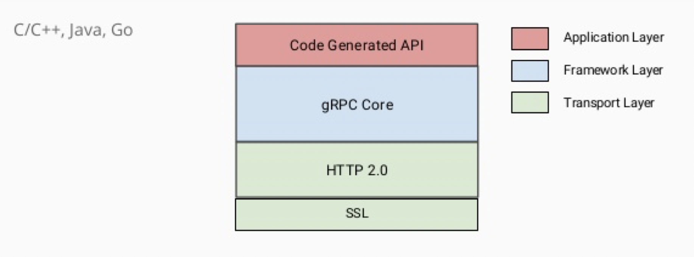
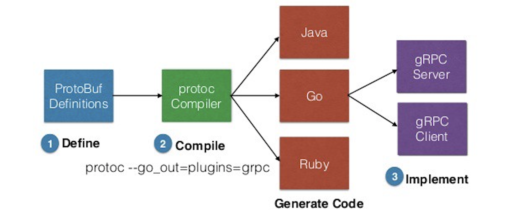

# gRPC - https://grpc.io/

## Overview

* gRPC is a high performance, open-source remote procedure call (RPC) framework that can run anywhere
* open sourced by Google in 2015
* It enables client and server applications to communicate transparently, and makes it easier to build connected systems
* gRPC leverages HTTP/2.0 underneath (see [HTTP/2][fa88e972])
* it uses an Interface Definition Language (IDL) to specify a schema for your data and services, called **Protocol Buffer**
* `g` in gRPC stands something different every gRPC release ([g stand for][5b631ec1])

  [fa88e972]: https://medium.com/@factoryhr/http-2-the-difference-between-http-1-1-benefits-and-how-to-use-it-38094fa0e95b "HTTP/2"
  [5b631ec1]: https://github.com/grpc/grpc/blob/master/doc/g_stands_for.md "g stand for"

<table><tr><td>

</td></tr></table>


## Workflow

<table><tr><td>

</td></tr></table>

### 1. ProtoBuf Definitions
* binary encoding format that allows you to specify a schema for your data using a specification language
* involves an interface description language (IDL) that describes the structure of data
* is implemented for various languages: Java, C, Go, JS etc.
* definition of your data and services in `.proto` files

```go
// protocol buffer sysntax version
syntax = "proto3";

package proto;

// data structure for our request
message Request {
    int64 a = 1;
    int64 b = 2;
}

// data structure for our response
message Response {
    int64 result = 1;
}

// service that handles requests and create responses
service AddService {
    rpc Add(Request) returns (Response);
    rpc Multiply(Request) returns (Response);
}
```

* see also  https://developers.google.com/protocol-buffers/docs/overview
* Protocol Buffer Language Guide https://developers.google.com/protocol-buffers/docs/proto


### 2. Compile ProtoBuf file

The ProtoBuf Definitions (`.proto` files) needs now to be compiled into your target language (here `golang`). Therefore we need to install the ProtoBuf compiler `protoc`.

#### Download and Install Protocol Buffer Compiler (`protoc`)

Download and install from https://github.com/protocolbuffers/protobuf/releases.

```
# 1. Download from  https://github.com/protocolbuffers/protobuf/releases.
# I used latest protoc-3.11.4-osx-x86_64.zip (ready-to-use binary for OSX) 

# 2. create folder to store protoc files
mkdir /usr/local/Cellar/protobuf
cd /usr/local/Cellar/protobuf # copy protoc-3.11.4-osx-x86_64.zip in here !!! 

# 2. Unpack it in folder /usr/local/Cellar/protobuf:
unzip protoc-3.11.4-osx-x86_64.zip

# 3. Create link to protoc in /usr/local/bin
ln -s /usr/local/Cellar/bin/protobuf/bin/protoc protoc

# 4. check, if you can call command 'protoc' from anywhere
cd ~
protoc
```

#### Download and Install golang dependent grpc packages

Here we are using `golang`, so we install the required `golang` packages for gRPC.

1. The main package for grpc:
`go get -u google.golang.org/grpc`

2. To use the protoc defintion and generating code out of that:
`go get -u github.com/golang/protobuf/protoc-gen-go`

#### Generate code based on proto file
After successful installation of the ProtoBuf compiler, we can use it now:

`sandbox$ protoc --proto_path=<folder of your protoc definition file> --proto_path=<location of google protoc third party code>  --go_out=plugins=grpc:proto service.proto`

**See also script `run_protoc.sh` !**

This will generate a file `service.pb.go` which includes real go code. This is our API code which we now can use for our application i.e. a web service.


### 3. Implement gRPC server/client
Now that we have the gRPC stub code (`service.pb.go`) we can use it in our application. In our case we will create a `server.go` file (**gRPC Server**) which will implement the `Add` and `Multiply` interface. A file `client.go` (**gRPC Client**) will call these functions via gRPC. We will implement the client as an REST API based on `gin/gonic` for convenient reasons to call the functions via browser. See the full code in server/client folders.
